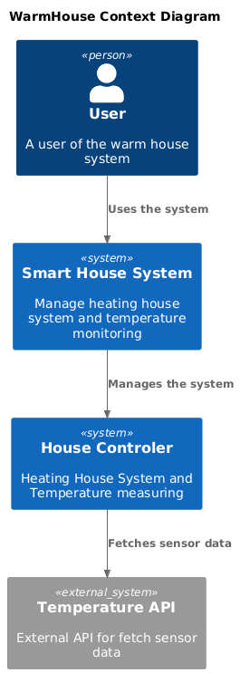
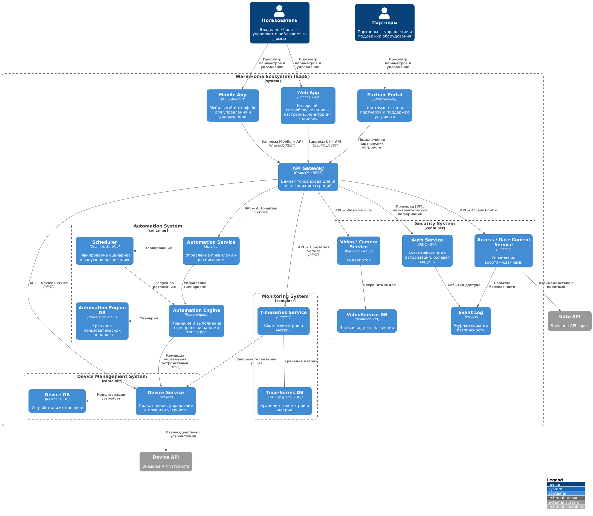
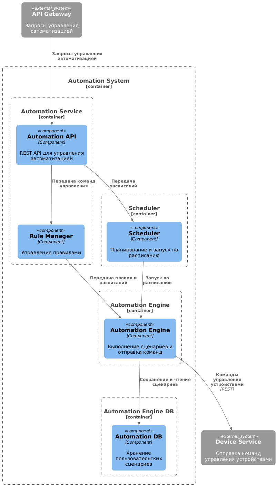
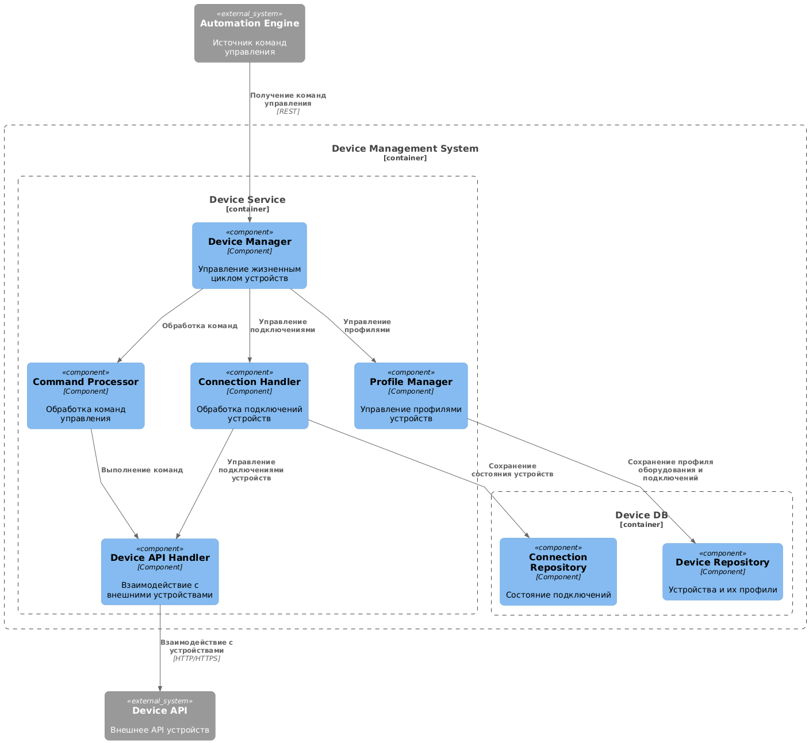
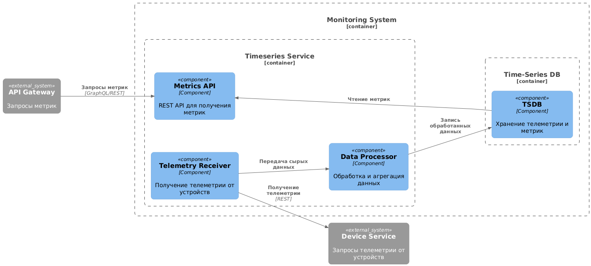
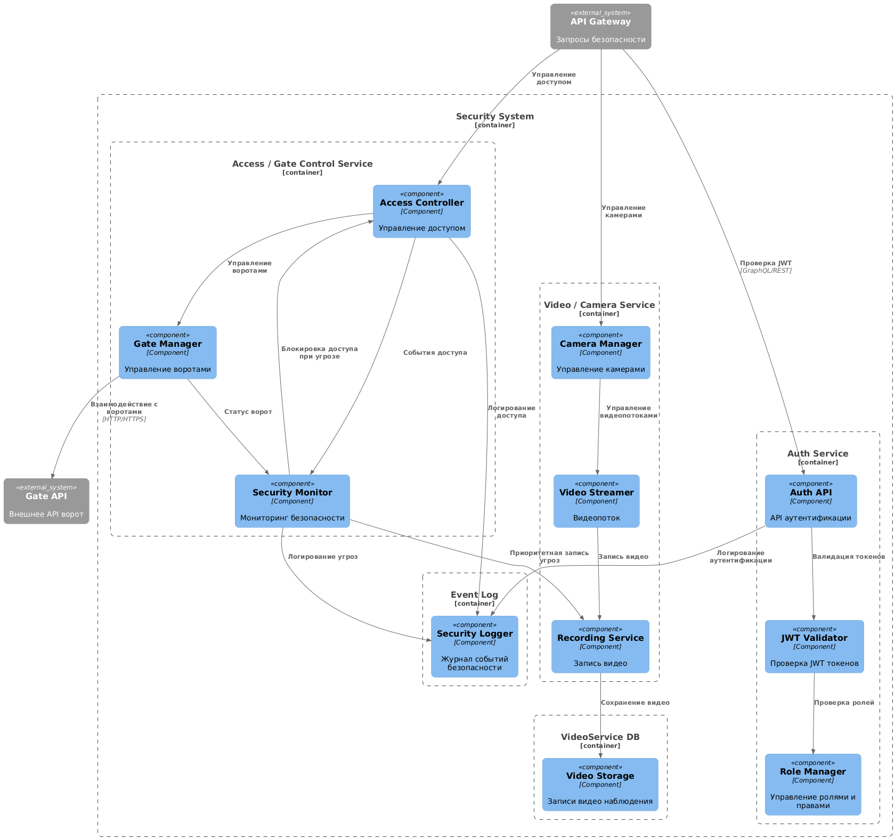
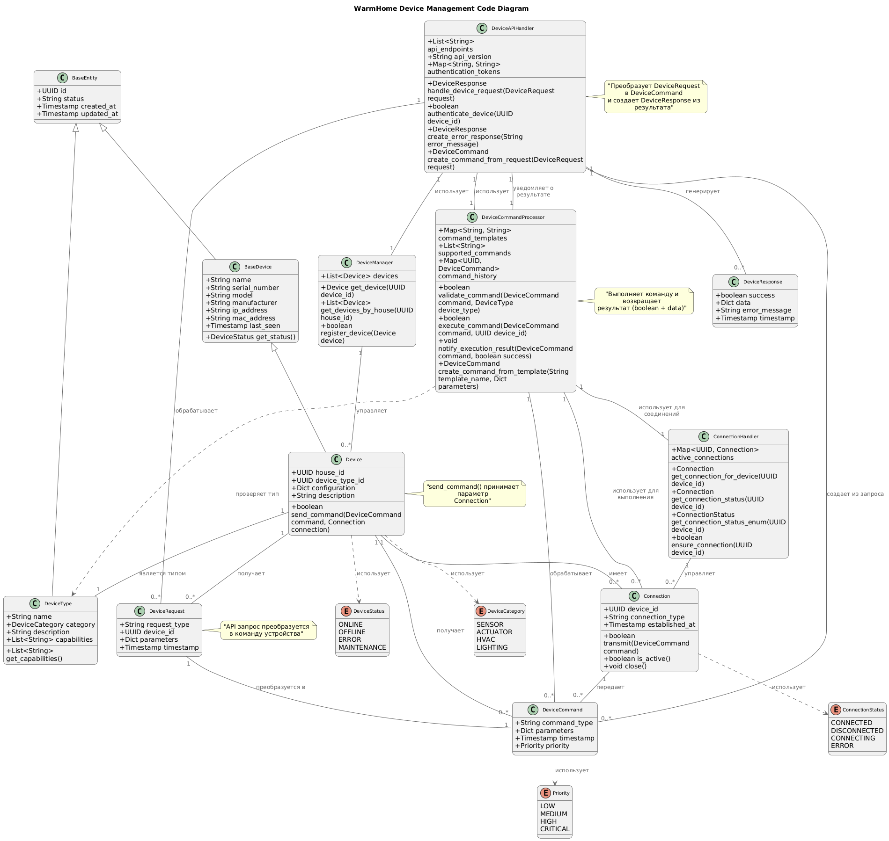
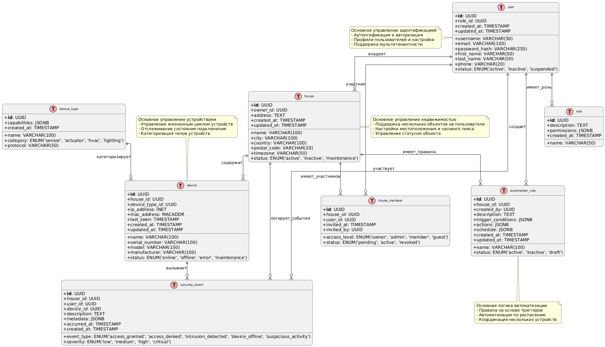

# Project_template

Это шаблон для решения проектной работы. Структура этого файла повторяет структуру заданий. Заполняйте его по мере работы над решением.

## Задание 1. Анализ и планирование

### 1. Описание функциональности монолитного приложения

**Управление отоплением:**

- Пользователи могут удалённо включать/выключать отопление в своих домах через веб-интерфейс.
- Система поддерживает специальные реле для управления, которые устанавливаются специалистами компании.

**Мониторинг температуры:**

- Пользователи могут просматривать текущую температуру в своих домах через веб-интерфейс.
- Система поддерживает подключение специальных датчиков, которые при включении регистрируются в системе. Только специалисты компании могу выполнить подключение домы к экосистеме.
- Система получает данные о температуре с датчиков, установленных в домах. Данные о температуре в систему поступают по Pull модели.

### 2. Анализ архитектуры монолитного приложения

- Язык программирования: Go
- База данных: PostgreSQL
- Архитектура: Монолитная, все компоненты системы (обработка запросов, бизнес-логика, работа с данными) находятся в рамках одного приложения.
- Взаимодействие: Синхронное, запросы обрабатываются последовательно.
- Масштабируемость: Ограничена, так как монолит сложно масштабировать по частям.
- Развертывание: Требует остановки всего приложения.

### 3. Определение доменов и границы контекстов

Опишем домены, осовываясь на целевой экосистемы.

- Домен: Мониторинг параметров дома
  - Поддомен телеметрии
    - Контекст: сбор данных со всех датчиков (состояние устройств, энергопотребление, влажность и т.д.)
    - Контекст: обработка событий и уведомлений (например, если датчик отвалился или превышен порог)

- Домен: Устройства
  - Поддомен управления устройствами
    - Контекст: подключение нового устройства (self-service онбординг)
    - Контекст: настройка устройства (выбор протокола, параметры)
    - Контекст: группировка устройств (например, комната, зона)

- Домен: Безопасность и доступ
  - Поддомен управления воротами
    - Контекст: открытие/закрытие ворот
    - Контекст: журнал событий (кто когда открыл)
  - Поддомен идентификации пользователя
    - Контекст: аутентификация (логин/пароль, биометрия)
    - Контекст: авторизация (права доступа к устройствам/модулям)
  - Поддомен удаленного наблюдения за домом
    - Контекст: видеопоток в реальном времени
    - Контекст: хранение записей (архив)

- Домен: Микроклимат
  - Поддомен управления отоплением
    - Контекст: ручное управление (вкл/выкл)
    - Контекст: автоматическое регулирование по целевой температуре
  - Поддомон управления освещением
    - Контекст: управление яркостью и режимами
    - Контекст: удалённое включение/выключение

- Домен: Автоматизация
  - Поддомен управления сценариями включения/выключения
    - Контекст: создание и редактирование сценария (например, «я ушёл из дома»)
    - Контекст: выполнение сценария (какие устройства запускаются, в какой последовательности)
  - Поддомен управления расписанием запуска сценария
    - Контекст: планировщик (cron-подобная логика: по времени, по дням недели)
    - Контекст: события-триггеры (по датчику движения, по температуре)

### **4. Проблемы монолитного решения**

- Сложно масштабировать нагрузку. Можно предположить, что пользователи будут чаще смотреть температуру, чем включать и выключать отопление. Нагрузка на чтение будет больше. Также стоит учитывать сезонность - в летний период нагрузка на экосистему будет меньше.
- Сложности в развертывании - пользователи теряют доступ к сервису при обновлении.
- Сложности в разработке и поддержке - разработчики могут работать над одним кодом, что приведет к сложностям объединения. Или команды могут блокировать другу други связанными задачами.
- Риск внесения ошибки - ошибки слияния нового кода, ошибка модификации специфичных методов и т.п.
- Синхронная обработка запросов, долгий запрос может замедлить работу всего сервиса.

### 5. Визуализация контекста системы — диаграмма С4



### Задание 2. Проектирование микросервисной архитектуры

**Диаграмма контейнеров (Containers)**



**Диаграмма компонентов (Components)**

- WarmHouse Automation_System Diagram


- WarmHouse Device_Management Diagram


- WarmHouse Monitoring_System Diagram


- WarmHouse Security_System Diagram


**Диаграмма кода (Code)**



# Задание 3. Разработка ER-диаграммы



# Задание 4. Создание и документирование API

### 1. Тип API

Укажите, какой тип API вы будете использовать для взаимодействия микросервисов. Объясните своё решение.

- Для взимодействия микросервисов используется REST API. В текущей архитектуре не предусматривается асинхрнного взаимодействия между сервисами. Внедрения ассинхронного API усложнит систему, но не предоставит значительного преимущества на текущем уровне пользователей системы. Аргументы ЗА REST API:
  - Простота разработки
  - Простота обслуживания
  - Большинство сценариев взаимодействия с системой требуют немедленного ответа от сервисов.
    - Например:
      - Пользователь включает/выключает отопление
      - Получение статуса устройств
      - Создание/редактирование сценариев
      - Аутентификация
  - AsyncAPI модет быть полезно при уведомления о выполнении сценариев автоматизаци, но в текущей версии это не реализовано.

### 2. Документация API

Описание API доступно по ссылке - https://ai-rogachev.github.io/architecture-warmhouse/

# Задание 5. Работа с docker и docker-compose

### Temperature API

Простой микросервис (на Python на базе фрейморка FastAPI) для получения данных о температуре в системе умного дома WarmHome.

### Возможности

- Получение температуры по названию комнаты
- Получение температуры по ID датчика
- Автоматическое сопоставление комнат и датчиков
- Случайная генерация значений температуры (15-30°C)

### Запуск

```bash
pip install -r requirements.txt
python main.py
```

API доступен по адресу: `http://localhost:8081`

### Эндпоинты

- `GET /` - статус сервиса
- `GET /temperature?location=Комната` - температура по комнате
- `GET /temperature/{sensor_id}` - температура по ID датчика

### Маппинг датчиков

| ID | Комната |
|----|---------|
| 1  | Гостиная |
| 2  | Спальня  |
| 3  | Кухня    |

### Docker

Микросервис упакован в Docker контейнер и интегрирован в docker-compose:

```bash
cd apps
docker compose up --build
```

Исходный код проект - [temperature-api](./apps/temperature-api)
